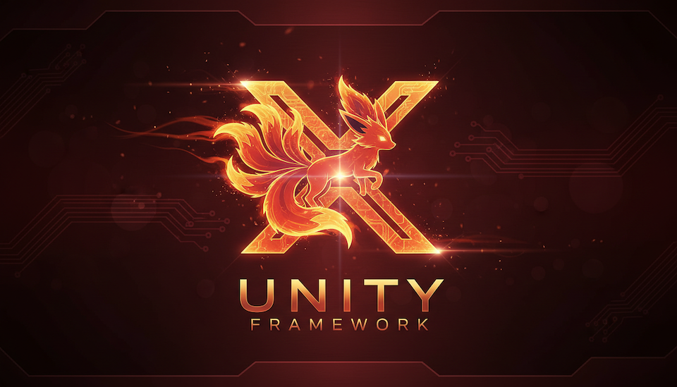

<div align="center">



# 🦊 VulpiX

**Modular Unity framework for clean, optimized, leak-free mobile games.**
*Pull only the packages you need.*


[](https://assetstore.unity.com/publishers/62476)

[Website](https://stefanocristoni.it) · [Asset Store](https://assetstore.unity.com/publishers/62476) · [Discussions](https://github.com/GuruGamesDev/VulpiX-public/discussions) · [Roadmap](https://github.com/GuruGamesDev/VulpiX-public/milestones)

</div>

---

> **This is the public hub for VulpiX** — documentation, roadmap, issue tracking and the free open-source
> modules. The full framework is distributed as a package on the [Unity Asset Store](https://assetstore.unity.com/publishers/62476).

## What is VulpiX?

VulpiX is a **modular Unity framework** built as a set of **independent UPM packages**. Use the whole thing
or just the pieces you need — scene flow, leak-safe Addressables, pooling, events, platform services and more.

It's the framework behind **[Milo Energy Run](https://stefanocristoni.it/project?id=milo-energy-run)** and
distills years of mobile optimization work — the same approach that brought a shipped open world from
**2.2 GB down to 500 MB** of runtime RAM (**12 → 30 fps** stable on Android/iOS).

## Why VulpiX?

- 🧩 **Modular** — 40+ packages with separate assembly definitions. Import only what you use.
- 🧠 **Leak-safe by design** — Addressables loading with safe, deterministic memory release.
- ⚡ **~50% faster project setup** — start a new game on solid foundations instead of wiring boilerplate.
- 🚢 **Battle-tested** — born from shipped mobile titles, not a toy project.

> 🧰 **Built with** [DOTween](http://dotween.demigiant.com/) for tweened animations and
> [Odin Inspector](https://odininspector.com/) for editor tooling and custom inspectors.

## Modules

> Status legend: 🆓 **Free** (open source, separate UPM repo) · 💎 **Pro** (Asset Store package) · 🛠️ **rolling out** (coming soon)

| Area | Module | Status |
|------|--------|--------|
| Core | Hierarchical singleton (static / protected / persistent) | 🆓 |
| Core | Core utils & extensions | 🆓 |
| Core | JSON utilities | 🆓 |
| Core | Events / messaging | 💎 |
| Memory | Object pooling | 🆓 |
| Memory | Leak-safe Addressables | 💎 |
| Loading | Scene flow, transitions & async loading | 💎 |
| Gameplay | Character animation system | 💎 |
| Gameplay | Time / slow-motion (DOTween) | 💎 |
| Gameplay | Typed stats & achievements | 💎 |
| Input | Touch input & multi-finger map navigation | 💎 |
| UI | Animable UI panels & button system | 💎 |
| Localization | 11-language localization | 💎 |
| Platform services | Auth · Cloud save · IAP · Ads · Leaderboards · Notifications · Analytics | 💎 |
| Tooling | Runtime debug suite | 💎 |
| Tooling | Files & storage (local / cloud, versioned, zip) | 💎 |
| Tooling | Application monitors (quality, FPS, battery, GC) | 💎 |
| Procedural | Mesh & procedural generation | 🆓 |
| Procedural | Object disposers | 🆓 |
| Procedural | Movement helpers (player / camera) | 🆓 |
| Rendering | Masking, sprite/texture & XML utils | 💎 |
| Platform | Android | 💎 |
| Platform | Apple / iOS | 💎 |
| Platform | PC | 🛠️ |
| Platform | Nintendo Switch | 🛠️ |

*The free module set is being curated and rolled out — watch this repo and the
[roadmap](https://github.com/GuruGamesDev/VulpiX-public/milestones).*

## Open-core model

The **free modules** live as standalone open-source repositories under
[github.com/GuruGamesDev](https://github.com/GuruGamesDev) and serve as a public, verifiable sample of how
VulpiX is built. The **complete framework** (all modules, support, updates) is available as a package on the
[Unity Asset Store](https://assetstore.unity.com/publishers/62476).

## Install (free modules, UPM)

Once a free module is published, add it via the Unity Package Manager → *Add package from git URL*:

```
https://github.com/GuruGamesDev/vulpix-<module>.git
```

Each free module repo documents its own install and usage.

## Roadmap, issues & discussions

- 🗺️ **[Roadmap / Milestones](https://github.com/GuruGamesDev/VulpiX-public/milestones)** — what's coming next.
- 🐞 **[Issues](https://github.com/GuruGamesDev/VulpiX-public/issues)** — report a bug or request a feature.
- 💬 **[Discussions](https://github.com/GuruGamesDev/VulpiX-public/discussions)** — questions, ideas, announcements.

## Links

- 🌐 Website — [stefanocristoni.it](https://stefanocristoni.it)
- 🛒 Unity Asset Store — [publisher page](https://assetstore.unity.com/publishers/62476)
- 👤 GitHub — [@GuruGamesDev](https://github.com/GuruGamesDev)

---

<div align="center">
Built by <a href="https://stefanocristoni.it">Stefano Cristoni</a> — Gameplay &amp; Performance Engineer.
</div>
